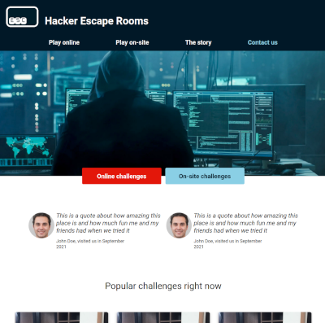

## Repo: esc-hacker-escape-rooms
# ESC - Hacker Escape Rooms  
### Min publicerade sida når du här: <a href="https://anteman-swe.github.io/esc-hacker-escape-rooms/dist/">https://anteman-swe.github.io/esc-hacker-escape-rooms/dist/</a>

---
## Projekt i Lernia YH utbildning SJPI25 med flera del-inlämningar  

Projektet bygger på en brief från ett fiktivt företag som ni kan läsa här: https://docs.google.com/document/d/1f-rogD-2GgbH3XdCCkNp3vFKK0Gizj3SoMAAcHSdN1k  

Projektet går ut på att skapa en hemsida för ett fiktivt företag som låter grupper utföra problem-lösning i ett flertal utmaningar, "Rooms"

  

## Challenges-sidan
- lag till 'challenges.html' med egen layout för our challenges. 
- Återanvänt header, footer, grundstyling för main.scss
- Lagt till grid-layout för korts, med: 
- kolumn på mobil, 2 kolumner på tablet, 3 kolumner på desktop. 
- har skapat två exempel kort för data-type = online och data-type = on-site som kan användas som mall när API:t kopplas
- lagt till filter Challenges knapp
- tagit bort hacker bilden så den matchar mallen från whimsical.  

